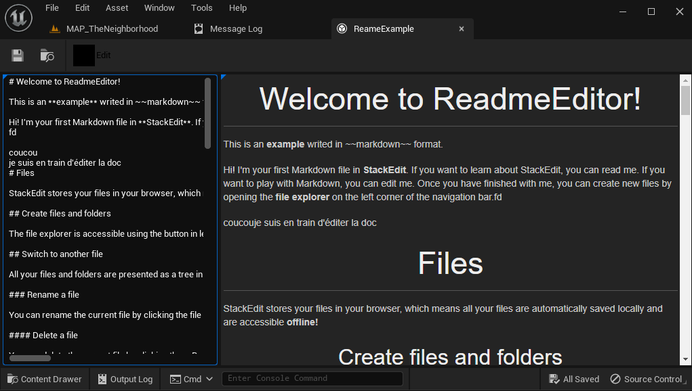

# ReadmeAsset

Unreal Engine 5 plug-in that adds a readme asset and editor for in-project documentation.

## About

The ReadmeUtility plug-in allow you to write a part of your project documentation in markdown format directly in editor. This can be useful. The sources are in [Github](https://github.com/Olive-fr/unreal-readme-utility)

## Supported Platforms

This plug-in was last built against **Unreal Engine 5.1.1**. It may works on Windows/Linux/MacOS but it's only tested on Windows yet.

## Usage

You can use this plug-in as a project plug-in, or an Engine plug-in.

If you use it as a project plug-in, clone this repository into your project's
*/Plugins* directory and compile your game in Visual Studio. A C++ code project
is required for this to work.

If you use it as an Engine plug-in, clone this repository into the
*/Engine/Plugins/Media* directory and compile your game. Full Unreal Engine 4
source code from GitHub (4.9 or higher) is required for this.

After compiling the plug-in, you have to **enable it** in Unreal Editor's
plug-in browser.

## Support

Please [file an issue](https://github.com/Olive-fr/unreal-readme-utility/issues),
submit a [pull request](https://github.com/Olive-fr/unreal-readme-utility/pulls)

## References

The markdown parser used is available [here](https://github.com/mity/md4c)
